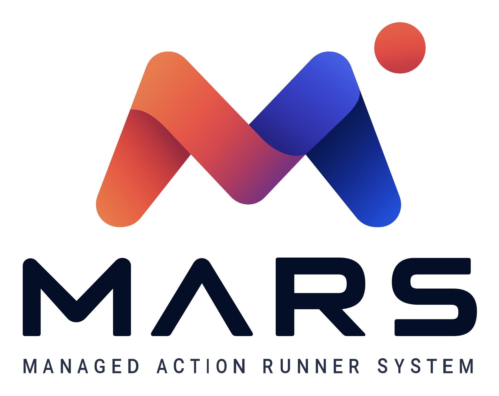

# MARS



**MARS (Managed Action Runner System)** brings scattered Windows, macOS, and Linux hardware together as your own GitHub Actions runner cluster. Manage workers centrally while choosing the platform and compute resources each workflow needs.

## Features

- **Pool the hardware you already have:** Bring workers on different hosts into a centrally managed runner fleet.
- **Install with one copied command:** Choose a supported platform in the dashboard, copy its generated install command, and run it on your hardware. Under **All workspaces → Workers**, expand the pending worker's **Review and approve** panel, verify its fingerprint and public key, choose an available runtime on Windows, set worker capacity and per-job limits, and approve it before it accepts jobs. Action cache settings are optional and collapsed by default.
- **Join with Node.js:** The dashboard also shows `npx --yes mars-worker-join@0.1.0 --control-plane-url <origin> --join-code <one-use-code>` for the default runtime on supported hosts (Windows x64/ARM64, Ubuntu 24.04 x64, macOS ARM64). Requires Node.js 20+, a configured worker connection origin, and available platform release artifacts. Custom Windows VM provisioning uses the platform-specific dashboard command. The npx package must be published to npm before this command works outside the repository.
- **Run multiple jobs per worker:** Allocate a worker's capacity across concurrent jobs instead of dedicating a whole machine to each job.
- **Share workers across organizations:** Use one worker fleet for repositories in multiple GitHub organizations.
- **Request the compute you need:** Specify CPU and memory in resource-aware `runs-on` labels, and route jobs to compatible pools. [Routing guide](docs/worker-routing-labels.md).
- **Retry failed workflow jobs:** Add a bounded `mars-retry-N` label to request GitHub reruns after failures, without changing the chosen worker resources.
- **Keep downloads local:** A worker-local caching proxy reduces repeated downloads of GitHub Actions resources.
- **Choose the execution environment:** Route across Windows x64, macOS ARM64, and Linux x64 pools; Windows supports Hyper-V-isolated containers or checkpoint-based VMs, and macOS uses Tart images. [Windows runtime options](docs/windows-worker-runtimes.md).
- **Manage the fleet from one place:** Onboard and approve workers, inspect health, and connect repositories through the control plane and dashboard.

> **Development status:** MARS is not yet a production-ready runner platform. Control-plane hosting is the current Linux/amd64 deployment milestone; end-to-end GitHub Actions job execution remains unfinished. See [implementation status](IMPLEMENTATION-STATUS.md) for the precise scope and blockers.

## Retry failed jobs

Add `mars-retry-3` alongside a resource-aware routing label to allow up to three additional executions after a failed or timed-out job:

```yaml
runs-on: [mars-any-2vcpu-4g, mars-retry-3]
```

`N` must be a whole number from 1 to 10 without a leading zero. Mars requests at most one rerun per completed workflow run attempt; a successful or cancelled job is not retried. GitHub reruns the selected job **and its dependent jobs**, so the retry budget is shared by the run attempt. Failed API requests are not automatically repeated: an ambiguous response could already have started another execution.

Existing GitHub App installations need **Actions: write** permission approved and the installation reauthorized before automatic reruns work. Updating the app manifest alone does not grant this permission.

## Get started

- [Development setup and worker commands](docs/development.md)
- [Windows worker runtimes and prerequisites](docs/windows-worker-runtimes.md)
- [GPU runner evaluation and deferred design](docs/gpu-runner-evaluation.md)
- [Control-plane deployment guide](deploy/control-plane/README.md)
- [Implementation status](IMPLEMENTATION-STATUS.md)

## License

No license has been declared yet.
